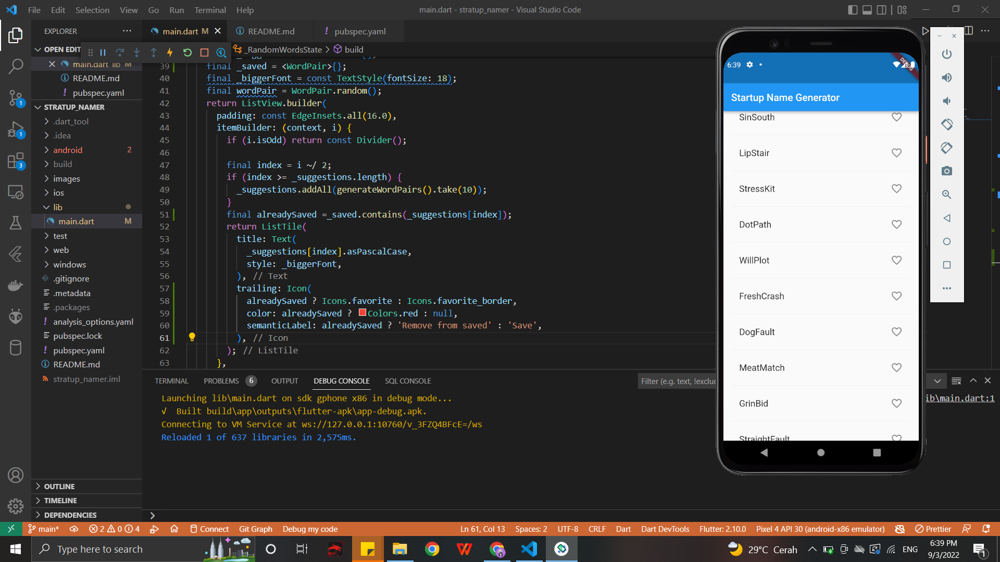
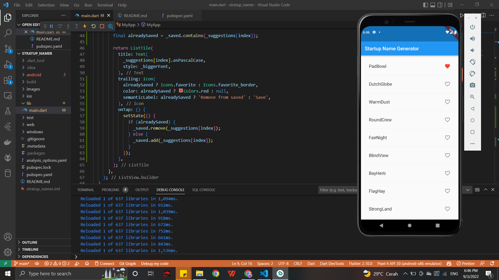
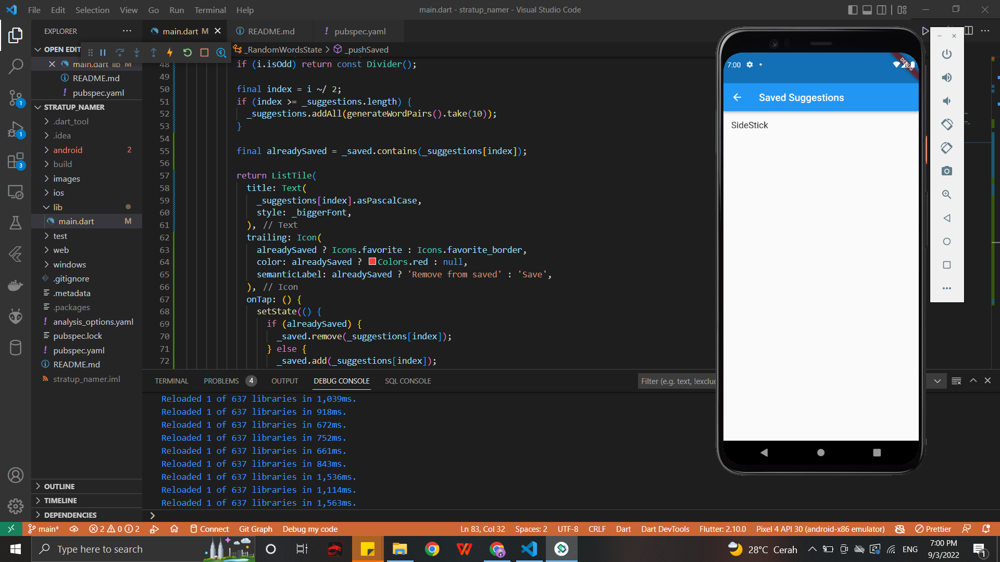
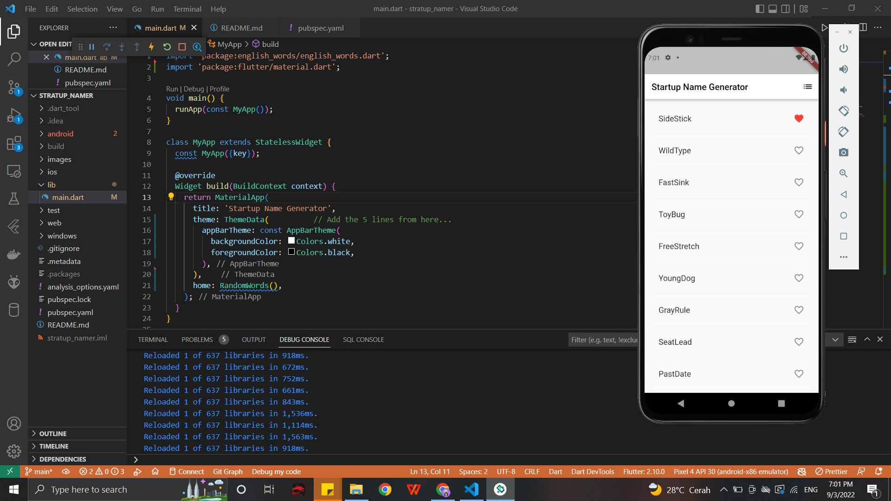

# stratup_namer

Google Codelabs | Write First Flutter App Part 1 | TSA 2022

3. Create the starter Flutter app

4. Use an external package

5. Add a stateful widget

6. Create an infinite scrolling ListView

Google Codelabs | Write First Flutter App Part 2 | TSA 2022
1. Menambahkan icon heart disetiap list

2. Menekan icon heart dan berubah warna menjadi merah 

3. Ketika icon berubah, maka itu artinya masuk ke dalam saved suggestion

4. Ketika theme di main.dart diganti

