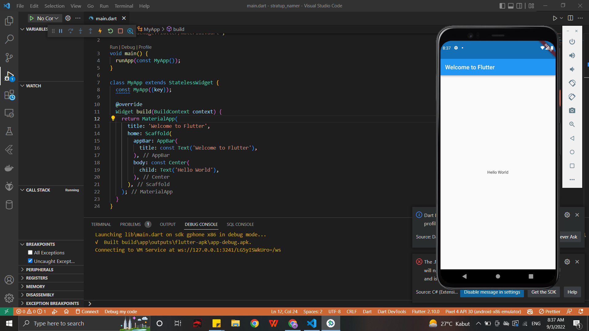

# stratup_namer

Google Codelabs | Write First Flutter App Part 1 | TSA 2022

3. Create the starter Flutter app

4. Use an external package

5. Add a stateful widget

6. Create an infinite scrolling ListView

